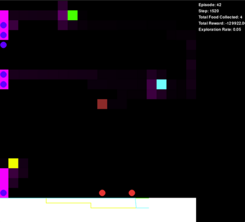
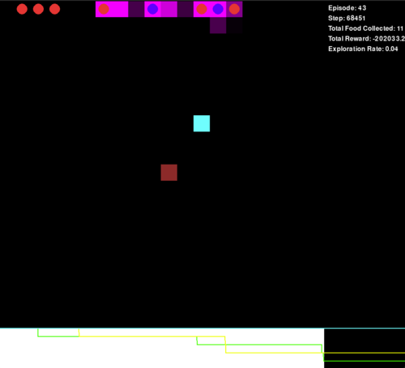

# Ant Colony Reinforcement Learning Simulation

## Overview
This project implements an interactive simulation of an ant colony using advanced reinforcement learning techniques, inspired by the [NetLogo Ants model](https://ccl.northwestern.edu/netlogo/models/Ants). The simulation demonstrates how a colony of ants can learn to efficiently collect food and return it to their nest, adapting their behavior over time through a sophisticated Q-learning algorithm, enhancing their foraging behavior.

## Key Features
1. **Reinforcement Learning**: Utilizes Q-learning, allowing ants to improve their food-gathering strategies over time.
2. **Interactive Visualization**: Provides a real-time, graphical representation of the ant colony, food sources, and pheromone trails.
3. **Dynamic Environment**: Features multiple food sources that deplete over time, encouraging adaptive behavior.
4. **Pheromone System**: Implements a pheromone trail mechanism that influences ant movement and decision-making.
5. **Performance Metrics**: Tracks and displays various performance indicators such as total food collected, rewards, and exploration rate.

## Components

### Ant Agent
- Represents individual ants in the colony.
- Makes decisions based on the current state and learned Q-values.
- Collects food and deposits pheromones.

### Ant Colony
- Manages the overall simulation environment.
- Coordinates multiple ant agents.
- Handles food placement and pheromone evaporation.

### Q-Learning Algorithm
- Implements the core learning mechanism.
- Updates Q-values based on actions and rewards.
- Balances exploration and exploitation through an epsilon-greedy strategy.

### Visualization
- Renders the simulation grid, ants, food sources, and pheromone trails.
- Provides a real-time graph of food levels.
- Displays a scoreboard with current simulation statistics.

    
    
Hive

    
    
Ant with Food Spreading Pheromone

    
    
Ant Without Food

    
    
Food

## How It Works
1. The simulation initializes with a set number of ants, food sources, and an empty pheromone grid.
2. Ants explore the environment, making decisions based on their current Q-values and the epsilon-greedy strategy.
3. When food is found, ants carry it back to the nest, leaving pheromone trails.
4. The Q-learning algorithm updates the ants' knowledge based on the rewards received.
5. Over time, ants learn more efficient paths to food sources.
6. The simulation runs for multiple episodes, with food sources resetting between episodes.

## Technical Implementation
- Built using HTML5 Canvas for rendering.
- Implemented in JavaScript for client-side execution.
- Utilizes asynchronous functions to load pre-trained Q-tables.
- Responsive design adapts to different screen sizes.

## Python Test Results
During the development phase, I conducted extensive tests using Python to optimize the reinforcement learning algorithm. My tests yielded the following key insights:

- The exploration rate stabilized after 42 episodes, indicating rapid learning and adaptation by the ant colony.
- I observed a significant improvement in food collection efficiency as the episodes progressed.

## Educational Value
This simulation serves as an educational tool to demonstrate:
- Principles of reinforcement learning in a visual, intuitive manner.
- Emergent behavior in multi-agent systems.
- The balance between exploration and exploitation in learning algorithms.
- How simple rules can lead to complex, adaptive behavior in biological-inspired systems.

## Use Case

This Ant Colony Reinforcement Learning Simulation has several practical applications and benefits:

1. **Optimization Problems**: The project demonstrates how reinforcement learning can be applied to solve complex optimization problems, such as finding the most efficient routes in logistics and supply chain management.

2. **Swarm Intelligence Research**: It serves as a platform for studying emergent behavior in swarm systems, which can be applied to fields like robotics and distributed computing.

3. **Educational Tool**: The simulation provides an interactive way to teach concepts of artificial intelligence, reinforcement learning, and complex adaptive systems to students and enthusiasts.

4. **Algorithm Development**: Researchers can use this simulation as a testbed for developing and refining new reinforcement learning algorithms.

5. **Nature-Inspired Computing**: The project showcases how biological systems can inspire computational methods, potentially leading to more efficient and adaptive AI systems.

## Technical Highlights

- Exploration rate stabilized after 42 episodes
- Significant improvement in food collection efficiency observed
- Demonstrates principles of reinforcement learning and emergent behavior

## Future Enhancements
- Implement obstacles or predators to create a more challenging environment.
- Add user controls to adjust simulation parameters in real-time.
- Incorporate different types of ants with specialized roles.
- Implement comparison modes between different learning algorithms.

This Ant Colony Reinforcement Learning simulation provides an engaging and interactive way to explore the principles of machine learning and swarm intelligence, offering insights into both artificial intelligence and biological systems.

## Demo
Experience the simulation firsthand: <a href="https://jeffasante.github.io/ant-colony-rl/" target="_blank">Ant Colony RL Demo</a>

This Ant Colony Reinforcement Learning simulation provides an engaging and interactive way to explore the principles of machine learning and swarm intelligence, offering insights into both artificial intelligence and biological systems.
